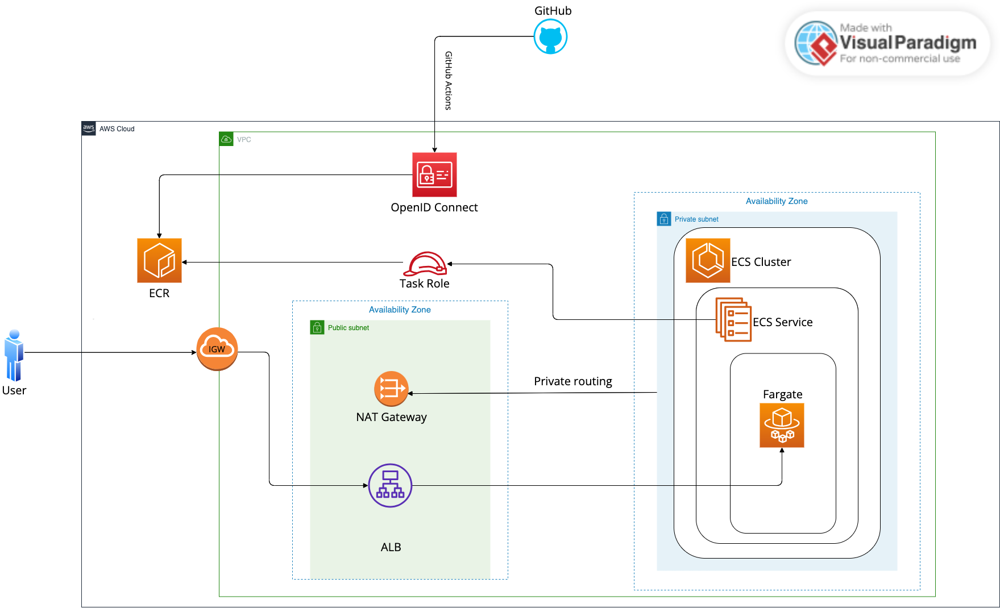

# Deployment of Web Server on Amazon Web Services

## Introduction
This repository contains the deployment code, scripts, and configuration files for deploying and maintaining a web server on Amazon Web Services (AWS). The solution utilizes AWS services such as Elastic Container Registry (ECR), Elastic Container Service (ECS), and Application Load Balancer (ALB) to ensure accessibility, security, scalability, and effective traffic handling.

## Deployment Process
- **Amazon Elastic Container Registry (ECR)**: Docker images are stored and managed in ECR to facilitate containerization.
- **Amazon ECS (Elastic Container Service)**: The web server is deployed as a Docker container using ECS, ensuring scalability and efficient resource utilization.
- **Application Load Balancer (ALB)**: Traffic is routed to the service via an ALB, enabling load balancing and high availability.
- **GitHub Actions Deployment**: The deployment process is automated using GitHub Actions, ensuring consistent and reliable deployments.
- **Security Measures**: Sensitive data, including credentials and configuration settings, are stored securely in GitHub Actions secrets to mitigate potential security risks.
- **OpenID Connect IAM Role**: IAM roles utilize OpenID Connect for authentication, providing a secure and standardized way to delegate access to AWS resources.
- **Security Group**: The CDK construct creates a security group that references the security group created in the CDK code, ensuring that only traffic on ports 80 and 443 is allowed.

## Deployment Workflow
The deployment workflow is triggered manually or through a webhook. The workflow includes the following steps:
1. **Checkout Repository**: The repository is checked out to the GitHub Actions runner.
2. **Configure AWS Credentials**: AWS credentials are configured using an IAM role with OpenID Connect authentication, which is assumed by GitHub Actions. The IAM role allows secure access to AWS services without storing access keys or secrets directly in GitHub Actions.
3. **Login to Amazon ECR**: Authentication is performed to login to Amazon ECR.
4. **Build, Tag, and Push Image to Amazon ECR**: The Docker image is built using the Dockerfile and pushed to Amazon ECR.
5. **Force New Deployment to ECS**: After the Docker image is successfully pushed to ECR, this step forces a new deployment to the ECS service. It ensures that the latest version of the Docker image is deployed to the ECS cluster, facilitating seamless updates to the web server.

## Architecture Overview

*The architecture diagram illustrates how the different components interact with each other, including ECR, ECS, ALB, private and public subnets, availability zones, and OpenID Connect authentication.*

## Usage
1. Clone this repository.
2. Review and customize the deployment code, scripts, and configuration files according to your specific requirements.
3. Follow the deployment process outlined in the README file to deploy the web server on AWS.
4. Monitor the deployment process and verify the functionality of the deployed web server.
5. Refer to the documentation for any troubleshooting or maintenance tasks.

## Additional Notes
- **OpenID Connect IAM Role**: The IAM role used in this deployment is configured with OpenID Connect (OIDC) as the identity provider. OpenID Connect allows for secure authentication and authorization, leveraging standardized protocols and tokens.
- **Benefits of OpenID Connect**: Using OpenID Connect provides several benefits, including:
  - Standardized authentication and authorization protocols for improved security.
  - Seamless integration with identity providers, such as Google, Facebook, and AWS Cognito.
  - Support for single sign-on (SSO) capabilities, simplifying user authentication across multiple applications.
  - Enhanced security features, such as token-based authentication and claims-based authorization.

## Resources Created via CDK Code
- **Amazon Elastic Container Registry (ECR)**: Docker images are stored and managed in ECR.
- **Amazon ECS Cluster**: A new ECS cluster is created to manage the containerized web server.
- **Application Load Balancer (ALB)**: An ALB is provisioned to distribute incoming traffic to the ECS service.
- **Security Group**: A security group is created to control the traffic allowed to and from the ALB.
- **OpenID Connect IAM Role**: IAM roles are configured with OpenID Connect for secure authentication and authorization.
- **Route 53 Alias**: Route 53 alias record is configured to route traffic to the ALB using a custom domain name.

## Additional Resources
- [AWS Documentation](https://docs.aws.amazon.com/)
- [AWS Elastic Container Registry (ECR)](https://aws.amazon.com/ecr/)
- [AWS Elastic Container Service (ECS)](https://aws.amazon.com/ecs/)
- [AWS Application Load Balancer (ALB)](https://aws.amazon.com/elasticloadbalancing/)
